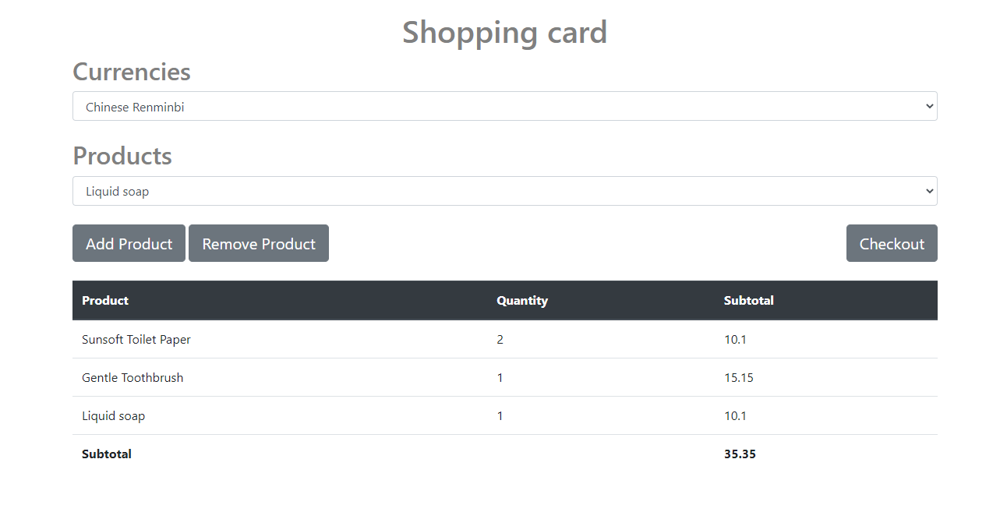

# virtual-react-shop

## Technologies used
* .NET Framework
* React.js (Typescript for type safety). The React root is in `VirtualReactShop.Web/ClientApp` folder.
* Redux

## Prerequisites
* NET 5.0
* Node.js

## How to run
* Open the `VirtualReactShop.sln` Visual Studio 2022
* Set `VirtualReactShop.Web` as a start up project
* When launched, it opens the browser at `https://localhost:44305/` where the client app is presented (note: as it is run in IIS Express, accept the dev certificate);

The client app also can be launched in a hot reload mode (dev server) by running `npm run start` command in the `ClientApp` folder.

